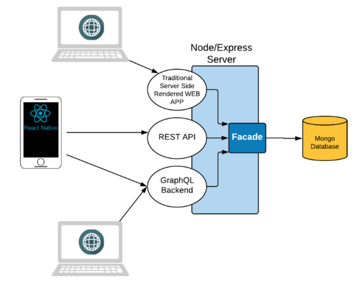

# js-mini-project

## Links

[mLab (DB)](https://mlab.com/home)

## Usage
Download afhængiheder:
```
$ yarn
```
eller,
```
$ npm install
```

Herefter kan benyttes følgende scripts (se `package.json` for mere info). `start`, `dev-mac`, `dev-win`, `test-mac`, `test-win`, `test-dev-mac`, `test-dev-win`

## Mini Project
To make the technologies we are going to cover throughout the semester a bit more interesting, many of the coming exercises will be focused on a common project idea, as outlined below:

## Model/idea
The idea is to have a backend for users, as sketched in this model. 
A user can have a geo-position, which will be sent from his phone. The position will only “live” for a short time, in order to be up-to-date. If not updated before this time, it will be removed. Users can also hold several job positions (programmer, student, football trainer etc.)
Authenticated Users, can create LocationBlog-entries as sketched in the figure and, also authenticated users, can “like” an entry (once only).



The model is deliberately held very simple, and miss many parts necessary for a “real” system. The model is also meant ONLY  as initial thoughts, which should be used as inspiration during the Schema Design.

## Architecture
This is not a single system, but rather three small demo systems with a lot of redundancy meant to try out different technologies. Having a common database + facade for all projects makes it easier to get time for all of it.

## Part-1: 
The first part represents a traditional web application, built with server-side rendering (pug, ejs or handlebars) and a MongoDB/mongoose database. Via this app, you should be able to log-in, create blog entries, and ideally also watch and like these entries.

## Part-2:
A simple friend-finder app, where you can log-in, via a phone, provide a radius to search for friends, and will be provided with a map, with the position of all your friend (inside this radius) 

## Part-3: 
Will introduce features from 1+2, but this time using Graph-QL, in order to demonstrate the advantages of this new technology

## Issues
### #0001 | Mocha hangs - 06/11/2018
Mocha hænger efter end testing. Ifølge [boneskull](https://boneskull.com/mocha-v4-nears-release/#mochawontforceexit) som skriver følgende "If the `mocha` process is still alive after your tests seem "done", then your tests have scheduled something to happen (asynchronously) and haven't cleaned up after themselves properly. Did you leave a socket open?".

Problemet kan løses ved et quick-fix hvis man benytter `--exit`. Dette skal løses bedre i fremtiden!

### #0002 | No debug msg - 07/11/2018
~~Problemet er kun set når det køres på mac - Når der bliver benyttet følgende to `package.json` scripts: `dev-mac` og `test-mac`, så bliver javascript `debug` modulet ikke aktiveret. Der bliver altså ikke logget i konsolen.~~

~~En mistanke er at `DEBUG='...'` ikke fungerer som det skal.~~

#### Fix - 08/11/2018
Scriptet skulle ændres fra `DEBUG=miniproject:* & mocha --recursive --exit` til `DEBUG=miniproject:* mocha --recursive --exit`

### #0003 | MissingSchemaError - 08/11/2018
~~Den nye function, i `./facades/position/positionFacade` , `findNearbyUsers` smider følgende Error `MissingSchemaError: Schema hasn't been registered for model "User".`. Umiddelbart bunder det i, at User schemaet ikke er blevet registreret til modellen User. Der benyttes `.populate()` som er den function der 'joiner' Position og User.~~

#### Fix - 08/11/2018
Løsningen var et flytte, i alle testFacader, en blok af variabledeklarationer op over:
```javascript
mongoose.models = {};
mongoose.modelSchemas = {};
mongoose.connection = {};
```

blokken af variabler der blev flyttet over var f.eks:
```javascript
const LocationBlog = require("../../models/LocationBlog");
const authFacade = require("../../facades/authFacade");
const User = require("../../models/User");
```

De to test der synede voldte problemet, og hvor overstående løsning virkede, var `testAuthFacade.js` og `testBlogFacade.js`. For sikkerheds skyld blev ændringen også implementeret i `testPositionFacade.js` og `testUserFacade.js`

### #0004 | exit code 3228369023 - 08/11/2018
~~Når der på en Windows maskine skal tilføje data til db, indtil videre kun set ved en bulk create, så ses det, at følgende error kommer `error Command failed with exit code 3228369023`. Denne error dukker KUN op ved en bulk indsætning:~~ 
```javascript
users = await Promise.all([
    new User({ firstName: "Kurt", lastName: "Wonnegut", userName: "kw", password: "test", email: "a@b.dk" }).save(),
    new User({ firstName: "Hanne", lastName: "Wonnegut", userName: "hw", password: "test", email: "b@b.dk" }).save(),
    ])
```

~~eller:~~
```javascript
users = await User.insertMany([
    new User({ firstName: "Bruce", lastName: "Wayne", userName: "joker", password: "test", email: "bat@man.org" }),
    new User({ firstName: "Joker", lastName: "NoName", userName: "batman", password: "test", email: "jo@ker.org" })
    ], { ordered: true })
```

~~men ikke:~~
```javascript
await Position.deleteMany({}).exec();
```

#### Fix - 08/11/2018
Problemet skyldtes måske følgende: *"This error code (3228369023 red.) is usually due to antivirus or malware scanner interfering with the npm install ... Disable or correctly configure your virus scanners and malware scanners."* Selvom jeg klonede projektet og downloadede afhængighederne med antivirus slået fra, så hjalp det ikke. 

Problemet opstod kun på min egen Windows maskine. Det var nemlig testet på en anden også.

Ved download af den nye LTS node version, blev problemet løst.